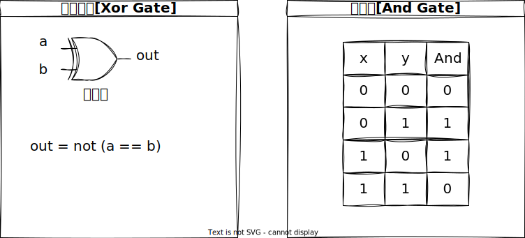

# 芯片设计

## 前言：仿真器、以及 Not 芯片开发流程

在芯片设计过程中，仿真是一个非常重要的环节，通过仿真，可以提前检测和排除设计中可能存在的错误和缺陷，避免在实际制造和应用中出现问题。此外，仿真还可以帮助设计者评估和优化电路的性能，提高电路的效率、可靠性和可维护性。从而，大大缩短设计周期和降低设计成本。

在这里，我们使用 nand2tetris 给我们提供的[仿真软件](https://www.nand2tetris.org/software)、以及[使用说明](https://www.nand2tetris.org/_files/ugd/44046b_bfd91435260748439493a60a8044ade6.pdf)。

接下来，我们借助仿真工具中的内置芯片 Nand 来开发 Not 芯片。以此，捋清楚芯片仿真开发的大致流程：

1.  **芯片 API 描述**



```md
芯片名称：Not
输入：in
输出：out
功能：if in=0 then out=1 else out=0.
描述：输入 0 则输出 1;输入 1 则输出 0。
```

1.  **根据 API 描述信息编写 Not.hdl**

    ```txt
    CHIP Not {
        IN a;
        OUT out;

        PARTS:
        Nand(a = a, b = a, out = out);
    }
    ```

2.  **编写 Not.cmp 预测 Not.hdl 的运行结果**

    ```txt
    | a |out|
    | 0 | 1 |
    | 1 | 0 |
    ```

3.  **编写 Not.tst 测试文件，对比 Not.hdl 实际运行结果与 Not.cmp 预期结果**

    ```txt
    /**
    * Not.tst: testing Not.hdl
    */
    load Not.hdl,
    output-file Not.out,
    compare-to Not.cmp,
    output-list a%B1.1.1 out%B1.1.1;

    set a 0, eval, output;
    set a 1, eval, output;
    ```

::: warning 特别说明：为什么使用 Nand 门作为基本单位？

NAND 门是一个数字电路逻辑门，它是由两个输入引脚和一个输出引脚组成的。它的输出根据其两个输入引脚的状态进行逻辑运算，如果两个输入都为高电平，则输出低电平，否则输出高电平，它的逻辑功能等价于“非与门”（NAND）。NAND 门是数字电路中最基本和最常见的逻辑门之一，可以用于构建其他类型的逻辑门和数字电路，是数字电路设计中非常重要的一部分。下面是 NAND 门的真值表：

| a   | b   | Nand(a, b) |
| --- | --- | :--------: |
| 0   | 0   |     1      |
| 0   | 1   |     1      |
| 1   | 0   |     1      |
| 1   | 1   |     0      |

其中，a 和 b 为 NAND 门的两个输入，Nand(a, b)为输出。当 a 和 b 都是高电平（1）时，输出为低电平（0）；而当任意一个或两个输入为低电平（0）时，输出都为高电平（1）。

综上所述，在 HDL（硬件描述语言）中，使用 NAND 门作为基本单位的主要原因是因为它是一种逻辑门，可以用于构建所有其他类型的逻辑门，包括与门、或门、非门等。此外，NAND 门具有完备的逻辑功能，能够进行所有逻辑操作，因此使用它可以减少设计和实现的复杂性，提高电路的可靠性和可维护性。

:::

## 1. 实现一个 And 门逻辑的芯片？



::: code-group

```md [API 文档]
- 芯片名：and
- 输入：a, b
- 输出：out
- 功能： if a=b=1 then out=1 else out=0
- 表达式：And(a, b) = Nand(Nand(a,b), Nand(a,b))
- 描述：只有当输入值都是 1 的时候，And 函数的输出值才为 1，否则输出为 0。
```

```txt [芯片描述文件 .hdl]
/**
* And gate
* out = if (a == 1 and b == 1) then 1 else 0
* And = Nand(Nand(a, b), Nand(a, b))
*/
CHIP And {
    IN a, b;
    OUT out;

    PARTS:
    Nand(a = a, b = b, out = o1);
    Nand(a = a, b = b, out = o2);
    Nand(a = o1, b = o2, out = out);
}
```

```txt [芯片测试文件 .tst]
/**
* And.tst: testing And.hdl 
*/
load And.hdl,
output-file And.out,
compare-to And.cmp,  
output-list a%B1.1.1 b%B1.1.1 out%B1.1.1;
set a 0, set b 0, eval, output;
set a 0, set b 1, eval, output;
set a 1, set b 0, eval, output;
set a 1, set b 1, eval, output;
```

```txt [芯片测试数据 .cmp]
| a | b |out|
| 0 | 0 | 0 |
| 0 | 1 | 0 |
| 1 | 0 | 0 |
| 1 | 1 | 1 |
```

:::

## 2. 实现一个 Or 门逻辑的芯片？



::: code-group

```md [API 文档]
- 芯片名：or
- 输入：a, b
- 输出：out
- 功能：if (a == 1 or b == 1) then out = 1 else out = 0
- 描述：只有当输入值都是 0 的时候，or 函数的输出值才为 0，否则输出为 1。
- 思路：Or = Nand(Not(a), Not(b))
```

```txt [芯片描述文件 .hdl]
/**
* Or gate
* 思路： or = Nand(Not(a), Not(b))
*/

CHIP Or {
	IN a, b;
	OUT out;

	PARTS:
	Not(in = a, out = o1);
	Not(in = b, out = o2);
	Nand(a = o1, b = o2, out = out);
}
```

```txt [芯片测试文件 .tst]
/**
* Or.tst: testing Or.hdl
*/

load Or.hdl,
output-file Or.out,
compare-to Or.cmp,
output-list a%B1.1.1 b%B1.1.1 out%B1.1.1;

set a 0, set b 0, eval, output;
set a 0, set b 1, eval, output;
set a 1, set b 0, eval, output;
set a 1, set b 1, eval, output;

```

```txt [芯片测试数据 .cmp]
| a | b |out|
| 0 | 0 | 0 |
| 0 | 1 | 1 |
| 1 | 0 | 1 |
| 1 | 1 | 1 |
```

:::

## 3. 实现一个 Xor 门逻辑的芯片？



::: code-group

```md [API 文档]
- 芯片名：Xor
- 输入：a, b
- 输出：out
- 功能：out = not (a == b)
- 描述：Xor，异或，当两个输入值相反的时候输出为 1，否则返回 0。
- 思路：Xor = Or(And(a, Not(b)), And(Not(a), b))
```

```txt [芯片描述文件 .hdl]
/**
* @name: Xor.hdl
* @expression: out = not (a == b)
* @parts: Xor = Or(And(a, Not(b)), And(Not(a), b))
*/

CHIP Xor {
	IN a, b;
	OUT out;

	PARTS:
	Not(in = b, out = n0);
	And(a = a, b = n0, out = a0);
	Not(in = a, out = n1);
	And(a = n1, b = b, out = a1);
	Or(a = a0, b = a1, out = out);
}

```

```txt [芯片测试文件 .tst]
/**
* Xor.tst: testing Xor.hdl
*/

load Xor.hdl,
output-file Xor.out,
compare-to Xor.cmp,
output-list a%B1.1.1 b%B1.1.1 out%B1.1.1;

set a 0,set b 0, eval, output;
set a 0,set b 1, eval, output;
set a 1,set b 0, eval, output;
set a 1,set b 1, eval, output;


```

```txt [芯片测试数据 .cmp]
| a | b |out|
| 0 | 0 | 0 |
| 0 | 1 | 1 |
| 1 | 0 | 1 |
| 1 | 1 | 0 |
```

:::
